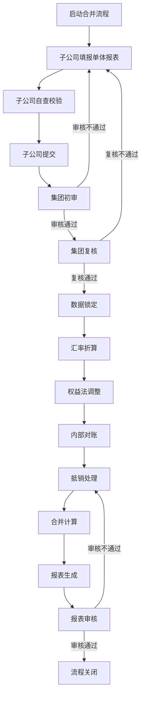
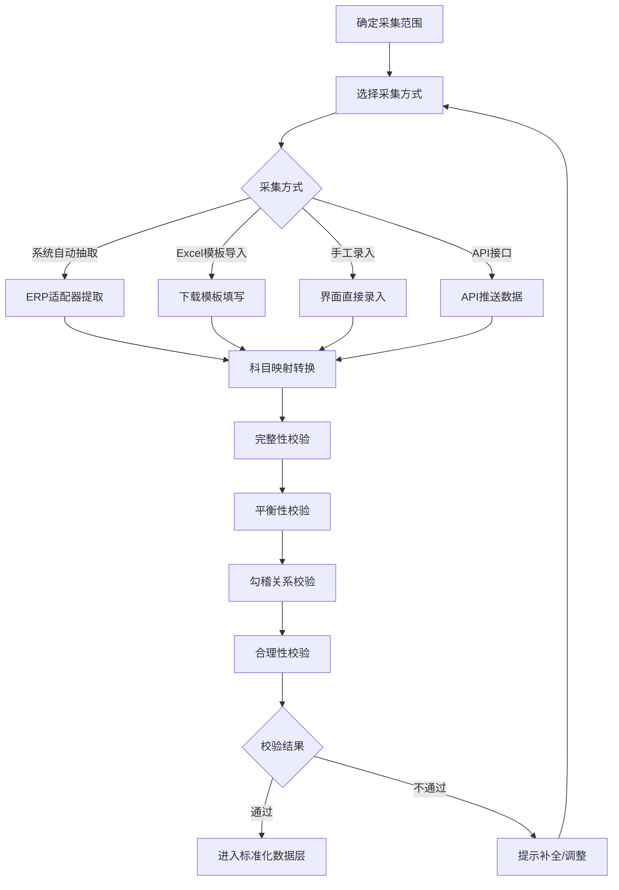
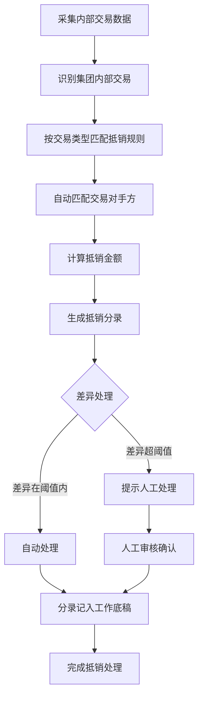

## 1. Product Overview
合并财务报表系统是一款集团级智能合并报表与财务分析平台，覆盖从数据采集、合并处理到报表生成、财务分析的全链路能力，核心解决"多主体财务报表如何高效、准确合并"的问题。面向中大型企业集团（子公司数量10-200+家），目标是将合并报表编制周期从2-3周缩短至3-5天，数据准确率达到99.5%以上。

## 2. Core Features

### 2.1 User Roles
| Role | Registration Method | Core Permissions |
|------|---------------------|------------------|
| 集团CFO/财务总监 | 系统管理员创建 | 查看合并报表、财务分析、仪表盘 |
| 合并报表专员 | 系统管理员创建 | 编制合并报表、管理抵销分录、工作底稿 |
| 子公司财务人员 | 系统管理员创建 | 填报单体报表、查看子公司数据 |
| 财务分析师 | 系统管理员创建 | 自定义报表、财务分析、指标计算 |
| 审计人员 | 系统管理员创建 | 查看审计追溯日志、工作底稿 |
| IT管理员 | 系统管理员创建 | 系统配置、权限管理、主数据维护 |

### 2.2 Feature Module
1. **首页仪表盘**: 财务概览、核心KPI、趋势图表、流程进度
2. **基础设置**: 组织架构管理、会计科目体系、币种汇率管理、会计期间管理
3. **合并范围与股权**: 合并范围配置、股权结构管理、股权结构图
4. **数据采集**: 数据录入、Excel导入、数据校验、审核流程
5. **合并处理**: 汇率折算、权益法调整、抵销处理、合并工作底稿
6. **合并报表**: 法定报表生成、报表勾稽校验、附注管理、报表导出
7. **自定义报表**: 报表设计器、数据源配置、维度指标自定义
8. **财务分析**: 指标体系、趋势/结构/对比分析、杜邦分析、分析报告
9. **流程管理**: 合并流程、审批流程、任务分配、消息通知
10. **系统管理**: 用户管理、权限配置、操作日志

### 2.3 Page Details
| Page Name | Module Name | Feature description |
|-----------|-------------|---------------------|
| 首页仪表盘 | 财务概览 | 展示核心财务指标（资产总额、负债总额、净利润、现金流），支持同比/环比分析 |
| 首页仪表盘 | 趋势图表 | 收入、利润趋势折线图，资产结构饼图，组织对比热力图 |
| 首页仪表盘 | 流程进度 | 显示当前合并周期各节点完成状态，逾期预警提示 |
| 基础设置 | 组织架构管理 | 树形结构展示集团组织层级，支持新增/编辑/删除法人单位，标记合并主体 |
| 基础设置 | 会计科目体系 | 集团统一科目维护，子公司科目映射配置，辅助核算维度设置 |
| 基础设置 | 币种汇率管理 | 币种信息维护，汇率类型管理（即期/期末/平均/历史），汇率录入与自动获取 |
| 基础设置 | 会计期间管理 | 期间日历维护，期间状态管理（未开启/已开启/已关闭/已锁定），多日历支持 |
| 合并范围与股权 | 合并范围配置 | 按合并主体设置纳入合并的子公司清单，合并方式设置（全面/比例/权益法） |
| 合并范围与股权 | 股权结构管理 | 股权投资信息维护，股权变动记录，商誉计算，股权结构图可视化 |
| 数据采集 | 数据录入 | 手工录入单体报表数据，支持资产负债表、利润表、现金流量表 |
| 数据采集 | Excel导入 | 下载标准模板，填写后上传导入，自动校验数据 |
| 数据采集 | 数据校验 | 完整性、平衡性、勾稽关系、合理性、口径一致性校验 |
| 数据采集 | 审核流程 | 子公司提交→集团初审→集团复核→数据锁定，支持退回修改 |
| 合并处理 | 汇率折算 | 非本位币报表折算，自动计算折算差额，折算日志可追溯 |
| 合并处理 | 权益法调整 | 成本法转权益法调整，自动生成调整分录 |
| 合并处理 | 抵销处理 | 内部股权投资抵销、内部往来抵销、内部存货/固定资产交易抵销、内部现金流抵销 |
| 合并处理 | 合并工作底稿 | 展示各单体报表数据、汇总数、抵销分录、合并数，支持钻取查看来源 |
| 合并报表 | 法定报表生成 | 生成合并资产负债表、利润表、现金流量表、所有者权益变动表 |
| 合并报表 | 报表勾稽校验 | 表内勾稽、表间勾稽自动校验，提示差异项 |
| 合并报表 | 附注管理 | 自动生成合并范围说明、会计政策、科目明细等附注内容 |
| 合并报表 | 报表导出 | 支持导出Excel、PDF、HTML、CSV格式 |
| 自定义报表 | 报表设计器 | 类Excel可视化设计界面，拖拽式字段绑定，可视化公式编辑器 |
| 自定义报表 | 数据源配置 | 支持多维数据库、外部数据库、Excel、API数据源 |
| 自定义报表 | 维度指标自定义 | 自定义分析维度和计算指标，指标公式编辑器 |
| 财务分析 | 指标体系 | 偿债能力、盈利能力、运营能力、成长能力指标计算与展示 |
| 财务分析 | 分析方法 | 趋势分析、结构分析、对比分析、杜邦分析 |
| 财务分析 | 可视化仪表盘 | 指标卡、趋势图、结构图、对比图、雷达图、热力图 |
| 财务分析 | 分析报告生成 | 预置报告模板，自动填充数据，支持导出Word/PDF |
| 流程管理 | 合并流程 | 流程启动→数据采集→审核→折算→调整→对账→抵销→合并→报表→审核→关闭 |
| 流程管理 | 审批流程 | 多级审批配置，审批意见记录，退回修改机制 |
| 流程管理 | 任务分配 | 将流程节点任务分配给责任人，进度跟踪，逾期预警 |
| 流程管理 | 消息通知 | 任务分配、到期/逾期、审批结果、异常预警通知，多渠道推送 |
| 系统管理 | 用户管理 | 用户信息维护，角色分配，密码重置 |
| 系统管理 | 权限配置 | 功能权限、数据权限、字段权限配置 |
| 系统管理 | 操作日志 | 记录用户操作、数据变更、合并过程日志 |

## 3. Core Process

### 3.1 月度合并报表编制流程

### 3.2 数据采集流程

### 3.3 抵销处理流程

## 4. User Interface Design

### 4.1 Design Style
- **主色调**: 深蓝色系 (#1e3a5f) 作为主色，传达专业、可信的财务系统形象
- **辅助色**: 金色 (#c9a962) 作为强调色，用于突出关键数据和操作按钮
- **中性色**: 深灰 (#2d3748)、中灰 (#718096)、浅灰 (#e2e8f0)、白色 (#ffffff)
- **按钮风格**: 圆角矩形，主按钮深蓝色背景金色文字，次按钮灰色背景深色文字
- **字体**: 中文使用"思源黑体"，英文使用"Inter"，建立清晰的信息层级
- **布局风格**: 左侧导航栏 + 顶部面包屑 + 主内容区，卡片式布局展示数据
- **图标风格**: 使用 Lucide 图标库，线性图标风格

### 4.2 Page Design Overview
| Page Name | Module Name | UI Elements |
|-----------|-------------|-------------|
| 首页仪表盘 | 财务概览 | 4个指标卡片横向排列，展示核心KPI数值和同比变化，卡片使用渐变背景和阴影 |
| 首页仪表盘 | 趋势图表 | 收入利润趋势折线图（左侧），资产结构环形图（右上），组织对比柱状图（右下） |
| 首页仪表盘 | 流程进度 | 横向时间轴展示流程节点，绿色已完成，蓝色进行中，灰色未开始，红色逾期 |
| 基础设置 | 组织架构管理 | 左侧树形结构，右侧详情面板，支持展开/折叠/搜索 |
| 基础设置 | 会计科目体系 | 表格展示科目列表，支持分页、筛选、排序，行内编辑 |
| 合并处理 | 合并工作底稿 | 多列表格，展示母公司、各子公司、汇总数、抵销分录、合并数，支持列冻结 |
| 合并报表 | 法定报表生成 | 报表预览区域，工具栏（导出、打印、刷新），勾稽校验结果提示 |
| 自定义报表 | 报表设计器 | 类Excel网格区域，左侧字段面板，顶部工具栏，公式编辑弹窗 |
| 财务分析 | 可视化仪表盘 | 多卡片布局，支持拖拽调整位置，图表联动过滤 |

### 4.3 Responsiveness
- **Desktop-first**: 针对1920x1080及以上分辨率优化
- **Tablet适配**: 1024px以下隐藏侧边栏，使用汉堡菜单；卡片单列或双列布局
- **Mobile适配**: 768px以下简化布局，核心功能优先展示，非核心功能折叠
- **触控优化**: 按钮最小点击区域48px，避免误触

### 4.4 交互设计
- **悬停效果**: 卡片悬停时上浮并添加阴影，按钮悬停时颜色加深
- **加载状态**: 数据加载时显示骨架屏，避免空白页面
- **错误提示**: 表单验证失败时实时显示红色提示文字
- **成功反馈**: 操作成功时显示绿色Toast提示
- **数据钻取**: 点击指标卡可钻取查看明细数据
- **图表联动**: 点击图表某一数据点，其他关联图表同步过滤