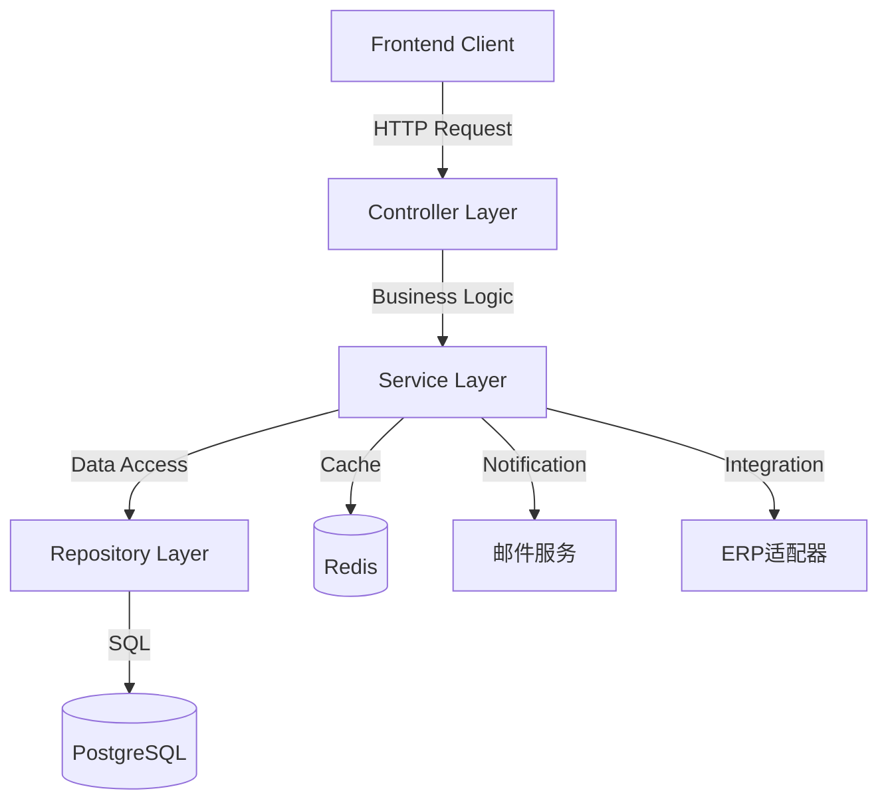

## 1. Architecture Design
```mermaid
flowchart TD
    subgraph Frontend
        FE[React@18 + TypeScript]
        Router[react-router-dom]
        State[zustand]
        UI[tailwindcss@3]
        Charts[echarts]
        Icons[lucide-react]
        FE --> Router
        FE --> State
        FE --> UI
        FE --> Charts
        FE --> Icons
    end
    
    subgraph Backend
        BE[Express@4 + TypeScript]
        Auth[JWT Authentication]
        API[RESTful API]
        BE --> Auth
        BE --> API
    end
    
    subgraph Data
        DB[PostgreSQL]
        Cache[Redis]
    end
    
    subgraph External Services
        ERP[ERP适配器]
        ETL[ETL工具]
        Mail[邮件服务]
    end
    
    Frontend -->|HTTP| Backend
    Backend -->|SQL| DB
    Backend -->|Cache| Cache
    Backend -->|Integration| ERP
    Backend -->|DataSync| ETL
    Backend -->|Notification| Mail
```

## 2. Technology Description
- **Frontend**: React@18 + TypeScript + tailwindcss@3 + vite
- **Initialization Tool**: vite-init (react-ts template)
- **Backend**: Express@4 + TypeScript
- **Database**: PostgreSQL (development: SQLite for simplicity)
- **State Management**: zustand
- **Routing**: react-router-dom@6
- **Charting**: echarts + react-echarts
- **Icons**: lucide-react
- **Build Tool**: vite@6

## 3. Route Definitions
| Route | Purpose | Component |
|-------|---------|-----------|
| / | 首页仪表盘 | Dashboard |
| /settings/organization | 组织架构管理 | OrganizationManage |
| /settings/accounts | 会计科目体系 | AccountManage |
| /settings/currency | 币种汇率管理 | CurrencyManage |
| /settings/period | 会计期间管理 | PeriodManage |
| /scope | 合并范围配置 | ScopeManage |
| /equity | 股权结构管理 | EquityManage |
| /collection | 数据采集 | DataCollection |
| /consolidation | 合并处理 | Consolidation |
| /workpaper | 合并工作底稿 | WorkPaper |
| /reports | 合并报表 | Reports |
| /custom-report | 自定义报表 | CustomReport |
| /analysis | 财务分析 | FinancialAnalysis |
| /workflow | 流程管理 | WorkflowManage |
| /system/users | 用户管理 | UserManage |
| /system/permissions | 权限配置 | PermissionManage |
| /system/logs | 操作日志 | LogManage |

## 4. API Definitions

### 4.1 Authentication API
| Method | Endpoint | Description |
|--------|----------|-------------|
| POST | /api/auth/login | 用户登录 |
| POST | /api/auth/logout | 用户登出 |
| GET | /api/auth/me | 获取当前用户信息 |

### 4.2 Organization API
| Method | Endpoint | Description |
|--------|----------|-------------|
| GET | /api/organizations | 获取组织列表 |
| GET | /api/organizations/:id | 获取组织详情 |
| POST | /api/organizations | 创建组织 |
| PUT | /api/organizations/:id | 更新组织 |
| DELETE | /api/organizations/:id | 删除组织 |

### 4.3 Account API
| Method | Endpoint | Description |
|--------|----------|-------------|
| GET | /api/accounts | 获取科目列表 |
| POST | /api/accounts | 创建科目 |
| PUT | /api/accounts/:id | 更新科目 |
| DELETE | /api/accounts/:id | 删除科目 |
| GET | /api/accounts/mappings | 获取科目映射 |
| POST | /api/accounts/mappings | 创建科目映射 |

### 4.4 Currency API
| Method | Endpoint | Description |
|--------|----------|-------------|
| GET | /api/currencies | 获取币种列表 |
| POST | /api/currencies | 创建币种 |
| GET | /api/exchange-rates | 获取汇率列表 |
| POST | /api/exchange-rates | 创建汇率 |

### 4.5 Period API
| Method | Endpoint | Description |
|--------|----------|-------------|
| GET | /api/periods | 获取期间列表 |
| POST | /api/periods | 创建期间 |
| PUT | /api/periods/:id/status | 更新期间状态 |

### 4.6 Scope API
| Method | Endpoint | Description |
|--------|----------|-------------|
| GET | /api/scopes | 获取合并范围列表 |
| POST | /api/scopes | 创建合并范围 |
| PUT | /api/scopes/:id | 更新合并范围 |

### 4.7 Equity API
| Method | Endpoint | Description |
|--------|----------|-------------|
| GET | /api/equities | 获取股权结构列表 |
| POST | /api/equities | 创建股权结构 |
| PUT | /api/equities/:id | 更新股权结构 |

### 4.8 Data Collection API
| Method | Endpoint | Description |
|--------|----------|-------------|
| GET | /api/collection/tasks | 获取采集任务列表 |
| POST | /api/collection/submit | 提交报表数据 |
| GET | /api/collection/validation | 数据校验结果 |

### 4.9 Consolidation API
| Method | Endpoint | Description |
|--------|----------|-------------|
| POST | /api/consolidation/run | 执行合并计算 |
| GET | /api/consolidation/results | 获取合并结果 |
| GET | /api/elimination | 获取抵销分录 |
| POST | /api/elimination | 创建抵销分录 |

### 4.10 Reports API
| Method | Endpoint | Description |
|--------|----------|-------------|
| GET | /api/reports | 获取报表列表 |
| GET | /api/reports/:id/data | 获取报表数据 |
| POST | /api/reports/export | 导出报表 |

### 4.11 Analysis API
| Method | Endpoint | Description |
|--------|----------|-------------|
| GET | /api/analysis/indicators | 获取财务指标 |
| GET | /api/analysis/trend | 获取趋势数据 |
| GET | /api/analysis/structure | 获取结构数据 |

### 4.12 Workflow API
| Method | Endpoint | Description |
|--------|----------|-------------|
| GET | /api/workflow/tasks | 获取任务列表 |
| POST | /api/workflow/approve | 审批通过 |
| POST | /api/workflow/reject | 审批驳回 |

### 4.13 System API
| Method | Endpoint | Description |
|--------|----------|-------------|
| GET | /api/system/users | 获取用户列表 |
| POST | /api/system/users | 创建用户 |
| PUT | /api/system/users/:id | 更新用户 |
| DELETE | /api/system/users/:id | 删除用户 |
| GET | /api/system/logs | 获取操作日志 |

## 5. Server Architecture Diagram


## 6. Data Model

### 6.1 Data Model Definition

```mermaid
erDiagram
    ORGANIZATION {
        id BIGSERIAL PK "组织ID"
        code VARCHAR "组织代码"
        name VARCHAR "组织名称"
        credit_code VARCHAR "统一社会信用代码"
        registered_address VARCHAR "注册地"
        currency_code VARCHAR "记账本位币"
        parent_id BIGINT FK "上级组织ID"
        is_consolidation BOOLEAN "是否合并主体"
        status VARCHAR "状态"
        created_at TIMESTAMP "创建时间"
        updated_at TIMESTAMP "更新时间"
    }
    
    ACCOUNT {
        id BIGSERIAL PK "科目ID"
        code VARCHAR "科目编码"
        name VARCHAR "科目名称"
        type VARCHAR "科目类型"
        balance_direction VARCHAR "余额方向"
        level INT "层级"
        parent_id BIGINT FK "上级科目ID"
        is_liquid BOOLEAN "是否流动"
        category VARCHAR "分类"
        created_at TIMESTAMP "创建时间"
        updated_at TIMESTAMP "更新时间"
    }
    
    ACCOUNT_MAPPING {
        id BIGSERIAL PK "映射ID"
        org_id BIGINT FK "组织ID"
        local_code VARCHAR "子公司科目编码"
        local_name VARCHAR "子公司科目名称"
        unified_id BIGINT FK "统一科目ID"
        mapping_type VARCHAR "映射类型"
        effective_period VARCHAR "生效期间"
        created_at TIMESTAMP "创建时间"
    }
    
    CURRENCY {
        id BIGSERIAL PK "币种ID"
        code VARCHAR "币种代码"
        name VARCHAR "币种名称"
        symbol VARCHAR "币种符号"
        decimal_places INT "小数位数"
        created_at TIMESTAMP "创建时间"
    }
    
    EXCHANGE_RATE {
        id BIGSERIAL PK "汇率ID"
        from_currency VARCHAR "源币种"
        to_currency VARCHAR "目标币种"
        rate_type VARCHAR "汇率类型"
        rate DECIMAL "汇率值"
        period VARCHAR "期间"
        effective_date DATE "生效日期"
        created_at TIMESTAMP "创建时间"
    }
    
    PERIOD {
        id BIGSERIAL PK "期间ID"
        year INT "年度"
        quarter INT "季度"
        month INT "月度"
        start_date DATE "开始日期"
        end_date DATE "结束日期"
        status VARCHAR "状态"
        calendar_type VARCHAR "日历类型"
        created_at TIMESTAMP "创建时间"
    }
    
    CONSOLIDATION_SCOPE {
        id BIGSERIAL PK "合并范围ID"
        name VARCHAR "合并范围名称"
        description VARCHAR "描述"
        created_at TIMESTAMP "创建时间"
    }
    
    SCOPE_ITEM {
        id BIGSERIAL PK "范围项ID"
        scope_id BIGINT FK "合并范围ID"
        org_id BIGINT FK "组织ID"
        consolidation_method VARCHAR "合并方式"
        effective_period VARCHAR "生效期间"
        created_at TIMESTAMP "创建时间"
    }
    
    EQUITY {
        id BIGSERIAL PK "股权ID"
        investor_id BIGINT FK "投资方ID"
        investee_id BIGINT FK "被投资方ID"
        share_ratio DECIMAL "持股比例"
        investment_cost DECIMAL "投资成本"
        investment_date DATE "投资日期"
        goodwill DECIMAL "商誉"
        created_at TIMESTAMP "创建时间"
    }
    
    EQUITY_CHANGE {
        id BIGSERIAL PK "股权变动ID"
        equity_id BIGINT FK "股权ID"
        change_type VARCHAR "变动类型"
        change_ratio DECIMAL "变动比例"
        change_amount DECIMAL "变动金额"
        change_date DATE "变动日期"
        description VARCHAR "变动描述"
        created_at TIMESTAMP "创建时间"
    }
    
    REPORT_DATA {
        id BIGSERIAL PK "报表数据ID"
        org_id BIGINT FK "组织ID"
        period_id BIGINT FK "期间ID"
        report_type VARCHAR "报表类型"
        account_id BIGINT FK "科目ID"
        amount DECIMAL "金额"
        currency_code VARCHAR "币种"
        version VARCHAR "版本"
        created_at TIMESTAMP "创建时间"
    }
    
    ELIMINATION_ENTRY {
        id BIGSERIAL PK "抵销分录ID"
        period_id BIGINT FK "期间ID"
        entry_type VARCHAR "分录类型"
        description VARCHAR "描述"
        created_at TIMESTAMP "创建时间"
    }
    
    ELIMINATION_LINE {
        id BIGSERIAL PK "抵销行ID"
        entry_id BIGINT FK "抵销分录ID"
        account_id BIGINT FK "科目ID"
        debit_amount DECIMAL "借方金额"
        credit_amount DECIMAL "贷方金额"
        org_id BIGINT FK "组织ID"
    }
    
    USER {
        id BIGSERIAL PK "用户ID"
        username VARCHAR "用户名"
        password_hash VARCHAR "密码哈希"
        real_name VARCHAR "真实姓名"
        email VARCHAR "邮箱"
        phone VARCHAR "电话"
        role VARCHAR "角色"
        status VARCHAR "状态"
        created_at TIMESTAMP "创建时间"
    }
    
    PERMISSION {
        id BIGSERIAL PK "权限ID"
        name VARCHAR "权限名称"
        code VARCHAR "权限编码"
        type VARCHAR "权限类型"
        description VARCHAR "描述"
    }
    
    ROLE_PERMISSION {
        role_id BIGINT FK "角色ID"
        permission_id BIGINT FK "权限ID"
    }
    
    OPERATION_LOG {
        id BIGSERIAL PK "日志ID"
        user_id BIGINT FK "用户ID"
        operation VARCHAR "操作类型"
        module VARCHAR "模块"
        content VARCHAR "操作内容"
        ip_address VARCHAR "IP地址"
        created_at TIMESTAMP "创建时间"
    }
    
    ORGANIZATION ||--o{ ORGANIZATION : "parent"
    ACCOUNT ||--o{ ACCOUNT : "parent"
    ORGANIZATION ||--o{ ACCOUNT_MAPPING : "has"
    ACCOUNT ||--o{ ACCOUNT_MAPPING : "mapped_to"
    CONSOLIDATION_SCOPE ||--o{ SCOPE_ITEM : "contains"
    ORGANIZATION ||--o{ SCOPE_ITEM : "included_in"
    ORGANIZATION ||--o{ EQUITY : "investor"
    ORGANIZATION ||--o{ EQUITY : "investee"
    EQUITY ||--o{ EQUITY_CHANGE : "has"
    ORGANIZATION ||--o{ REPORT_DATA : "submitted"
    PERIOD ||--o{ REPORT_DATA : "for"
    PERIOD ||--o{ ELIMINATION_ENTRY : "for"
    ELIMINATION_ENTRY ||--o{ ELIMINATION_LINE : "contains"
    USER ||--o{ OPERATION_LOG : "performed"
```


### 6.2 Data Definition Language

```sql
CREATE TABLE organizations (
    id BIGSERIAL PRIMARY KEY,
    code VARCHAR(50) UNIQUE NOT NULL,
    name VARCHAR(200) NOT NULL,
    credit_code VARCHAR(50),
    registered_address VARCHAR(500),
    currency_code VARCHAR(10) DEFAULT 'CNY',
    parent_id BIGINT REFERENCES organizations(id),
    is_consolidation BOOLEAN DEFAULT FALSE,
    status VARCHAR(20) DEFAULT 'active',
    created_at TIMESTAMP DEFAULT CURRENT_TIMESTAMP,
    updated_at TIMESTAMP DEFAULT CURRENT_TIMESTAMP
);

CREATE TABLE accounts (
    id BIGSERIAL PRIMARY KEY,
    code VARCHAR(50) UNIQUE NOT NULL,
    name VARCHAR(200) NOT NULL,
    type VARCHAR(50),
    balance_direction VARCHAR(10),
    level INT DEFAULT 1,
    parent_id BIGINT REFERENCES accounts(id),
    is_liquid BOOLEAN DEFAULT FALSE,
    category VARCHAR(50),
    created_at TIMESTAMP DEFAULT CURRENT_TIMESTAMP,
    updated_at TIMESTAMP DEFAULT CURRENT_TIMESTAMP
);

CREATE TABLE account_mappings (
    id BIGSERIAL PRIMARY KEY,
    org_id BIGINT REFERENCES organizations(id),
    local_code VARCHAR(50),
    local_name VARCHAR(200),
    unified_id BIGINT REFERENCES accounts(id),
    mapping_type VARCHAR(20),
    effective_period VARCHAR(20),
    created_at TIMESTAMP DEFAULT CURRENT_TIMESTAMP
);

CREATE TABLE currencies (
    id BIGSERIAL PRIMARY KEY,
    code VARCHAR(10) UNIQUE NOT NULL,
    name VARCHAR(100) NOT NULL,
    symbol VARCHAR(10),
    decimal_places INT DEFAULT 2,
    created_at TIMESTAMP DEFAULT CURRENT_TIMESTAMP
);

CREATE TABLE exchange_rates (
    id BIGSERIAL PRIMARY KEY,
    from_currency VARCHAR(10) NOT NULL,
    to_currency VARCHAR(10) NOT NULL,
    rate_type VARCHAR(20),
    rate DECIMAL(18,8) NOT NULL,
    period VARCHAR(20) NOT NULL,
    effective_date DATE,
    created_at TIMESTAMP DEFAULT CURRENT_TIMESTAMP,
    UNIQUE(from_currency, to_currency, rate_type, period)
);

CREATE TABLE periods (
    id BIGSERIAL PRIMARY KEY,
    year INT NOT NULL,
    quarter INT,
    month INT,
    start_date DATE NOT NULL,
    end_date DATE NOT NULL,
    status VARCHAR(20) DEFAULT 'unopened',
    calendar_type VARCHAR(20) DEFAULT 'gregorian',
    created_at TIMESTAMP DEFAULT CURRENT_TIMESTAMP
);

CREATE TABLE consolidation_scopes (
    id BIGSERIAL PRIMARY KEY,
    name VARCHAR(200) NOT NULL,
    description TEXT,
    created_at TIMESTAMP DEFAULT CURRENT_TIMESTAMP
);

CREATE TABLE scope_items (
    id BIGSERIAL PRIMARY KEY,
    scope_id BIGINT REFERENCES consolidation_scopes(id),
    org_id BIGINT REFERENCES organizations(id),
    consolidation_method VARCHAR(20),
    effective_period VARCHAR(20),
    created_at TIMESTAMP DEFAULT CURRENT_TIMESTAMP
);

CREATE TABLE equities (
    id BIGSERIAL PRIMARY KEY,
    investor_id BIGINT REFERENCES organizations(id),
    investee_id BIGINT REFERENCES organizations(id),
    share_ratio DECIMAL(5,4) NOT NULL,
    investment_cost DECIMAL(20,2),
    investment_date DATE,
    goodwill DECIMAL(20,2),
    created_at TIMESTAMP DEFAULT CURRENT_TIMESTAMP
);

CREATE TABLE equity_changes (
    id BIGSERIAL PRIMARY KEY,
    equity_id BIGINT REFERENCES equities(id),
    change_type VARCHAR(20),
    change_ratio DECIMAL(5,4),
    change_amount DECIMAL(20,2),
    change_date DATE,
    description TEXT,
    created_at TIMESTAMP DEFAULT CURRENT_TIMESTAMP
);

CREATE TABLE report_data (
    id BIGSERIAL PRIMARY KEY,
    org_id BIGINT REFERENCES organizations(id),
    period_id BIGINT REFERENCES periods(id),
    report_type VARCHAR(50),
    account_id BIGINT REFERENCES accounts(id),
    amount DECIMAL(20,2),
    currency_code VARCHAR(10),
    version VARCHAR(20) DEFAULT 'draft',
    created_at TIMESTAMP DEFAULT CURRENT_TIMESTAMP
);

CREATE TABLE elimination_entries (
    id BIGSERIAL PRIMARY KEY,
    period_id BIGINT REFERENCES periods(id),
    entry_type VARCHAR(50),
    description TEXT,
    created_at TIMESTAMP DEFAULT CURRENT_TIMESTAMP
);

CREATE TABLE elimination_lines (
    id BIGSERIAL PRIMARY KEY,
    entry_id BIGINT REFERENCES elimination_entries(id),
    account_id BIGINT REFERENCES accounts(id),
    debit_amount DECIMAL(20,2),
    credit_amount DECIMAL(20,2),
    org_id BIGINT REFERENCES organizations(id)
);

CREATE TABLE users (
    id BIGSERIAL PRIMARY KEY,
    username VARCHAR(50) UNIQUE NOT NULL,
    password_hash VARCHAR(255) NOT NULL,
    real_name VARCHAR(100),
    email VARCHAR(200),
    phone VARCHAR(50),
    role VARCHAR(50),
    status VARCHAR(20) DEFAULT 'active',
    created_at TIMESTAMP DEFAULT CURRENT_TIMESTAMP
);

CREATE TABLE permissions (
    id BIGSERIAL PRIMARY KEY,
    name VARCHAR(100) NOT NULL,
    code VARCHAR(100) UNIQUE NOT NULL,
    type VARCHAR(20),
    description TEXT
);

CREATE TABLE role_permissions (
    role_id BIGINT REFERENCES users(id),
    permission_id BIGINT REFERENCES permissions(id),
    PRIMARY KEY(role_id, permission_id)
);

CREATE TABLE operation_logs (
    id BIGSERIAL PRIMARY KEY,
    user_id BIGINT REFERENCES users(id),
    operation VARCHAR(50),
    module VARCHAR(50),
    content TEXT,
    ip_address VARCHAR(50),
    created_at TIMESTAMP DEFAULT CURRENT_TIMESTAMP
);

INSERT INTO currencies (code, name, symbol, decimal_places) VALUES
('CNY', '人民币', '¥', 2),
('USD', '美元', '$', 2),
('EUR', '欧元', '€', 2),
('JPY', '日元', '¥', 0),
('GBP', '英镑', '£', 2);

INSERT INTO accounts (code, name, type, balance_direction, level, is_liquid, category) VALUES
('1000', '资产', 'asset', 'debit', 1, FALSE, 'asset'),
('1001', '库存现金', 'asset', 'debit', 2, TRUE, 'current'),
('1002', '银行存款', 'asset', 'debit', 2, TRUE, 'current'),
('1122', '应收账款', 'asset', 'debit', 2, TRUE, 'current'),
('1403', '原材料', 'asset', 'debit', 2, TRUE, 'current'),
('1405', '库存商品', 'asset', 'debit', 2, TRUE, 'current'),
('1601', '固定资产', 'asset', 'debit', 2, FALSE, 'non-current'),
('1602', '累计折旧', 'asset', 'credit', 2, FALSE, 'non-current'),
('1701', '无形资产', 'asset', 'debit', 2, FALSE, 'non-current'),
('2000', '负债', 'liability', 'credit', 1, FALSE, 'liability'),
('2202', '应付账款', 'liability', 'credit', 2, TRUE, 'current'),
('2501', '长期借款', 'liability', 'credit', 2, FALSE, 'non-current'),
('3000', '所有者权益', 'equity', 'credit', 1, FALSE, 'equity'),
('3001', '实收资本', 'equity', 'credit', 2, FALSE, 'equity'),
('3002', '资本公积', 'equity', 'credit', 2, FALSE, 'equity'),
('3101', '盈余公积', 'equity', 'credit', 2, FALSE, 'equity'),
('3103', '未分配利润', 'equity', 'credit', 2, FALSE, 'equity'),
('4000', '成本', 'cost', 'debit', 1, FALSE, 'cost'),
('5000', '损益', 'income', 'credit', 1, FALSE, 'income'),
('6001', '主营业务收入', 'income', 'credit', 2, FALSE, 'operating'),
('6401', '主营业务成本', 'expense', 'debit', 2, FALSE, 'operating'),
('6601', '销售费用', 'expense', 'debit', 2, FALSE, 'operating'),
('6602', '管理费用', 'expense', 'debit', 2, FALSE, 'operating'),
('6603', '财务费用', 'expense', 'debit', 2, FALSE, 'operating'),
('6801', '所得税费用', 'expense', 'debit', 2, FALSE, 'non-operating');

INSERT INTO users (username, password_hash, real_name, email, role, status) VALUES
('admin', '$2b$10$N9qo8uLOickgx2ZMRZoMye.IjzqAKL9xL5jvMFVdNJHvGCgTq/VEq', '系统管理员', 'admin@example.com', 'admin', 'active'),
('cfo', '$2b$10$N9qo8uLOickgx2ZMRZoMye.IjzqAKL9xL5jvMFVdNJHvGCgTq/VEq', '财务总监', 'cfo@example.com', 'cfo', 'active'),
('consolidator', '$2b$10$N9qo8uLOickgx2ZMRZoMye.IjzqAKL9xL5jvMFVdNJHvGCgTq/VEq', '合并专员', 'consolidator@example.com', 'consolidator', 'active');

INSERT INTO organizations (code, name, credit_code, registered_address, currency_code, is_consolidation, status) VALUES
('GROUP', '集团总部', '911100001234567890', '北京市朝阳区', 'CNY', TRUE, 'active'),
('SUB1', '子公司A', '911100001234567891', '上海市浦东新区', 'CNY', FALSE, 'active'),
('SUB2', '子公司B', '911100001234567892', '广东省深圳市', 'CNY', FALSE, 'active'),
('SUB3', '子公司C', '911100001234567893', '江苏省苏州市', 'USD', FALSE, 'active'),
('SEG1', '业务板块一', '', '', 'CNY', TRUE, 'active'),
('SEG2', '业务板块二', '', '', 'CNY', TRUE, 'active');

UPDATE organizations SET parent_id = (SELECT id FROM organizations WHERE code = 'GROUP') WHERE code IN ('SEG1', 'SEG2');
UPDATE organizations SET parent_id = (SELECT id FROM organizations WHERE code = 'SEG1') WHERE code IN ('SUB1', 'SUB3');
UPDATE organizations SET parent_id = (SELECT id FROM organizations WHERE code = 'SEG2') WHERE code = 'SUB2';

INSERT INTO equities (investor_id, investee_id, share_ratio, investment_cost, investment_date, goodwill) VALUES
((SELECT id FROM organizations WHERE code = 'GROUP'), (SELECT id FROM organizations WHERE code = 'SUB1'), 0.85, 100000000.00, '2020-01-01', 5000000.00),
((SELECT id FROM organizations WHERE code = 'GROUP'), (SELECT id FROM organizations WHERE code = 'SUB2'), 0.70, 80000000.00, '2021-06-01', 3000000.00),
((SELECT id FROM organizations WHERE code = 'GROUP'), (SELECT id FROM organizations WHERE code = 'SUB3'), 0.90, 120000000.00, '2019-03-01', 8000000.00);

INSERT INTO periods (year, quarter, month, start_date, end_date, status) VALUES
(2026, 1, 1, '2026-01-01', '2026-01-31', 'closed'),
(2026, 1, 2, '2026-02-01', '2026-02-28', 'closed'),
(2026, 1, 3, '2026-03-01', '2026-03-31', 'opened'),
(2026, 2, 4, '2026-04-01', '2026-04-30', 'unopened');

INSERT INTO exchange_rates (from_currency, to_currency, rate_type, rate, period, effective_date) VALUES
('USD', 'CNY', 'spot', 7.2450, '2026-03', '2026-03-01'),
('USD', 'CNY', 'average', 7.2380, '2026-03', '2026-03-01'),
('EUR', 'CNY', 'spot', 7.8210, '2026-03', '2026-03-01'),
('JPY', 'CNY', 'spot', 0.0485, '2026-03', '2026-03-01');
```